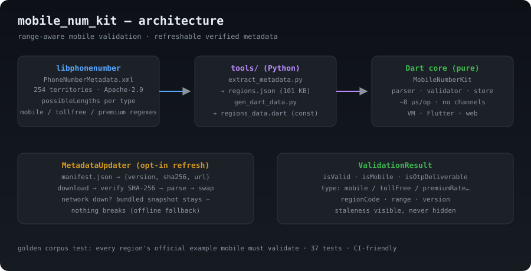

# country_mobile_validator



**Validate mobile numbers per country with the real, actual length ranges —
works out-of-the-box with `country_code_picker`.**

`country_mobile_validator` is the missing piece in the Dart ecosystem: existing
phone packages validate "any phone number" against **frozen** metadata, return
booleans, and can't tell you that a number is a **mobile** number (or that
Argentina allows **10–11** digits while New Zealand allows **8–10**).

This library:

- ✅ Validates **mobile numbers only** (OTP-ready) — rejects landlines,
  toll-free, premium-rate, and short codes.
- ✅ **Range-aware**: every country exposes its real mobile length range
  (`8–10`, `10–11`, …) so you never hardcode "10 digits" again.
- ✅ **`country_code_picker`-friendly**: pick a country, validate the number
  against *that country's* actual mobile length range — no second library.
- ✅ **Refreshable metadata** (SHA-256 verified, offline fallback) — bundled
  data from [libphonenumber](https://github.com/google/libphonenumber)
  (Apache-2.0), updatable at runtime.
- ✅ Pure Dart core — works on Flutter, Dart VM, and web. ~8 µs per
  validation, no platform channels.
- ✅ Handles `+`, separators, Unicode digits, extensions, trunk prefixes, and
  shared country codes (`+1` → US/CA/…, `+44` → GB/GG/JE/…).

---

## Quick start

```dart
import 'package:country_mobile_validator/country_mobile_validator.dart';

final kit = MobileNumberKit();

// Smart: auto-detects country from the calling code.
final r = kit.validate('+919876543210');          // India
print(r.isValid);      // true
print(r.isMobile);     // true
print(r.regionCode);   // IN

// Pinned: validate in national format against a specific country.
final v = kit.forRegion('AR');                    // Argentina
print(v.validate('91123456789').isValid);         // true (11 digits)
print(v.validate('911234567').isValid);           // false (too short)
print(v.lengthHint);                              // "10–11 digits"
```

## `country_code_picker` integration (the workflow this library was built for)

Use [country_code_picker](https://pub.dev/packages/country_code_picker) for the
flag/dial-code picker, then validate against **that country's actual mobile
length range** — the picker gives you `Country.countryCode` (`'IN'`, `'US'`…)
and `Country.dialCode` (`'+91'`…). No second library needed:

```dart
import 'package:country_code_picker/country_code_picker.dart';
import 'package:country_mobile_validator/country_mobile_validator.dart';

final kit = MobileNumberKit();
Country? selected;

CountryCodePicker(
  onChanged: (Country c) => selected = c,
)

// On submit:
void submit(String input) {
  final v = kit.forRegion(selected!.countryCode);     // e.g. 'IN'
  final res = v.validate(input);                       // national format
  if (!res.isValid) {
    // Error message uses the REAL range, e.g. "Enter a valid Indian mobile
    // number (10 digits)" — never a hardcoded length.
    error = 'Enter a valid mobile number (${v.lengthHint})';
  }
}
```

Live length feedback while typing (still valid for AR 10–11, NZ 8–10…):

```dart
controller.addListener(() {
  final v = kit.forRegion(selected!.countryCode);
  final len = controller.text.replaceAll(RegExp(r'\D'), '').length;
  setState(() => hint = v.isMobileLength(len) ? '✓' : 'Needs ${v.lengthHint}');
});
```

Or use the convenience one-liner:

```dart
final res = kit.validateForCountry(selected!.countryCode, input);
```

## The range API (the differentiator)

```dart
final v = kit.forRegion('NZ');                    // New Zealand
print(v.mobileLengthRange);  // (8, 10)
print(v.lengthHint);         // "8–10 digits"
print(v.isMobileLength(8));  // true
print(v.isMobileLength(7));  // false
```

Length variance is real: **AR 10–11, NZ 8–10, BR 10–11, ID 9–12, DE 10–11,
GB 10, IN 10, US 10**. `country_mobile_validator` knows them all.

## Type awareness (OTP-safe verdicts)

```dart
final r = kit.validate('+18005551234');           // US toll-free
print(r.type);            // NumberType.tollFree — NOT mobile
print(r.isOtpDeliverable);// false — don't send an OTP here
```

A `800`-number will never pass as a mobile. Types: `mobile`, `fixedLine`,
`tollFree`, `premiumRate`, `sharedCost`, `shortCode`, `unknown`.

## Refreshable metadata ("real-time")

Bundled data is versioned. Update it at runtime with SHA-256 verification:

```dart
final updater = MetadataUpdater(
  manifestUrl: 'https://example.com/mobile-num-metadata/manifest.json',
);
final res = await updater.checkAndUpdate(currentVersion: kit.metadataVersion);
if (res.success && res.newVersion != null) {
  kit.loadRefreshedMetadata(updater.lastVerifiedJson!, version: res.newVersion!);
} else {
  // Offline fallback: keep using the bundled snapshot. Nothing breaks.
}
```

On web, inject your own fetcher (e.g. `package:http`):

```dart
MetadataUpdater(
  manifestUrl: '...',
  fetcher: (url) async => (await http.get(Uri.parse(url))).bodyBytes,
);
```

The manifest is a tiny JSON:

```json
{ "version": "2026.08", "sha256": "…", "url": "…" }
```

## Region detection with shared country codes

`+1` covers 25 NANP regions; `+44` covers GB, GG, JE, IM. The library resolves
by longest-prefix match, tries the main region first, then the others, and
returns the region whose mobile pattern actually matches:

```dart
kit.validate('+14155552671').regionCode;   // US (415 = San Francisco)
kit.validate('+14165551234').regionCode;   // CA (416 = Toronto)
```

## What it handles

| Input | Behavior |
|---|---|
| `+91 98765 43210` | separators stripped |
| `٠٩٨٧٦٥٤٣٢١٠` | Arabic-Indic digits normalized |
| `+1 415 555 2671 x123` | extension split off, ignored |
| `011 91 98765 43210` | `011` international prefix handled |
| `+1…` vs `+44…` | longest-prefix calling-code match |
| `9876543210` (IN) | region-pinned national format |

## Development

```bash
dart pub get
dart test          # 37 tests: golden corpus over all 247 mobile regions + updater
dart analyze
dart run benchmark/bench.dart
```

Metadata refresh pipeline:

```bash
python3 tools/extract_metadata.py   # libphonenumber XML → tools/data/regions.json
python3 tools/gen_dart_data.py      # JSON → lib/src/data/regions_data.dart
```

## License & attribution

Apache-2.0. Metadata is generated from
[libphonenumber](https://github.com/google/libphonenumber) (Apache-2.0,
Copyright Google Inc.). Validators are compared against libphonenumber's
example corpus on every test run.
